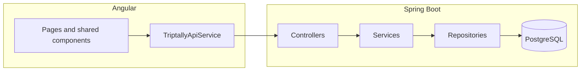

# TripTally

## Project description

TripTally is a full-stack web app for **group travel expense sharing**. People on the same trip can log spending with travel-oriented categories, assign a **payer**, and split each expense **equally**, by **exact amounts**, **percentages**, or **weighted shares**. The backend computes **per-member balances**, suggests a **small set of payments** to settle debts, and supports **recording settlements** when money changes hands. Members can **upload receipts** (stored on the local filesystem in development; easy to swap for cloud storage later), **export trip data as CSV**, and use **JWT-based login**. The product also includes **user profile updates**, **in-app notifications**, and **payment requests** between trip members so groups can coordinate paybacks without leaving the app.

## Tools & technologies

| Area | Stack |
|------|--------|
| **Backend runtime** | Java 21, Apache Maven |
| **Backend framework** | Spring Boot 4 — Spring Web MVC, Spring Data JPA (Hibernate), Spring Security, Jakarta Bean Validation |
| **Auth & API** | JWT via **JJWT**; BCrypt for password hashes |
| **Database** | **PostgreSQL** (main); **H2** for automated tests |
| **Backend productivity** | Lombok |
| **Frontend** | Angular 16, TypeScript 5, RxJS, Zone.js |
| **Frontend UI** | Tailwind CSS 3, PostCSS, Autoprefixer |
| **Icons** | **Iconify** web component (`iconify-icon`, MDI set via CDN in `index.html`) |

## Architecture

| Layer | Responsibility |
|--------|----------------|
| **Controller** | REST endpoints, validation trigger (`@Valid`) |
| **Service** | Business rules, authorization via `TripAccessService`, orchestration |
| **Repository** | Spring Data JPA + `Specification` for expense filters |
| **DTO / Mapper** | API contracts (`DtoMapper`) |
| **Domain** | JPA entities, enums (`ExpenseCategory`, `SplitMode`, …) |
| **Security** | JWT (`JwtService`, `JwtAuthenticationFilter`), BCrypt passwords |
| **Storage** | `LocalReceiptStorageService` — files under `triptally.storage.receipts-dir` (swap for S3/Cloudinary later) |
| **Schema** | Hibernate `ddl-auto` in `application.properties` (e.g. `create-drop` or `update` in dev; prefer `validate` in production with managed DDL) |

Frontend: **Angular 16**, **Tailwind CSS 3**, **Iconify** (web component), typed interfaces under `src/app/models/`.



## Split logic (backend)

- **Equal**: divide total with `RoundingMode.DOWN` on each share except the last, which absorbs remainder so the sum matches the expense exactly.
- **Exact**: each participant’s amount is set; **sum must equal** the expense total (scale 2).
- **Percentage**: each line is a percent; **total must be 100** (scale 2); amounts are `amount × pct / 100`, last line absorbs rounding remainder.
- **Shares**: positive weights; each share is `amount × weight / totalWeights`, last line absorbs remainder.

Only **trip members** can appear on an expense. **Payer** must be a member of that trip.

## Settlement simplification

1. Compute **gross** `totalPaid` and `totalOwed` from expenses (payer vs participant `owedAmount`).
2. **Net before settlements** = `paid − owed` per member.
3. Apply recorded **settlements**: `from` member **+amount**, `to` member **−amount** (cash the debtor paid out / creditor received).
4. **Greedy matcher**: repeatedly pair the **most negative** net with the **most positive** net and create a suggestion for `min(|debt|, credit)` until no meaningful balances remain (stops below **R0.01** to avoid float dust).

This minimizes the number of suggested payments; it is **not** the only mathematically valid set of transfers, but it is simple and works well for portfolio demos.

## Trade-offs and future work

- **Receipt storage**: local filesystem only; replace `LocalReceiptStorageService` with S3/Cloudinary for production.
- **Invites**: email is stored on `TripMember`; full email delivery and “accept invite” flow is a natural next step.
- **Public read-only trip link**, **multi-currency with FX**, **budgets**, and **offline drafts** are listed as nice-to-haves in the product brief.
- **Global exception handler** returns a generic message for unexpected errors — log aggregation would be added for production.

## Prerequisites

- **Java 21**, **Maven**
- **Node.js 18+** (for Angular CLI / npm)
- **PostgreSQL 14+** with database `triptally` (or adjust URL)

## Database

Create DB (example):

```sql
CREATE DATABASE triptally;
```

Configure `Trip-Backend/src/main/resources/application.properties` (or environment variables) for URL, user, and password.

## Run backend

```bash
cd Trip-Backend
mvn spring-boot:run
```

Optional **demo seed** (runs only when the `users` table is empty):

```bash
mvn spring-boot:run -Dspring-boot.run.profiles=demo
```

Demo logins (after demo profile):

- `alex@triptally.demo` / `Demo123!`
- `sam@triptally.demo` / `Demo123!`

Set a strong JWT secret in production:

```bash
set TRIPTALLY_JWT_SECRET=your-256-bit-secret-here   # Windows
export TRIPTALLY_JWT_SECRET=your-256-bit-secret-here # Unix
```

Receipts directory (optional):

```bash
set TRIPTALLY_RECEIPTS_DIR=C:\data\triptally-receipts
```

API base: `http://localhost:8080`

## Run frontend

```bash
cd trip-frontend
npm install
npm start
```

App: `http://localhost:4200` — API URL is `src/environments/environment.ts` (`http://localhost:8080`).

Production build:

```bash
npx ng build
```

## API overview

| Area | Method | Path |
|------|--------|------|
| Auth | POST | `/api/auth/register`, `/api/auth/login` |
| Auth | GET | `/api/auth/me` |
| Auth | PATCH / POST | `/api/auth/me` (profile), `/api/auth/change-password` |
| Trips | CRUD + members + expenses + balances + settlements + summary + CSV + payment-requests | `/api/trips/...` |
| Expenses | GET/PUT/DELETE + receipt | `/api/expenses/{id}` |
| Notifications | GET / POST | `/api/notifications`, `/api/notifications/unread-count`, `/api/notifications/{id}/read` |

See controllers under `com.tripTally.controller` for the full contract.
